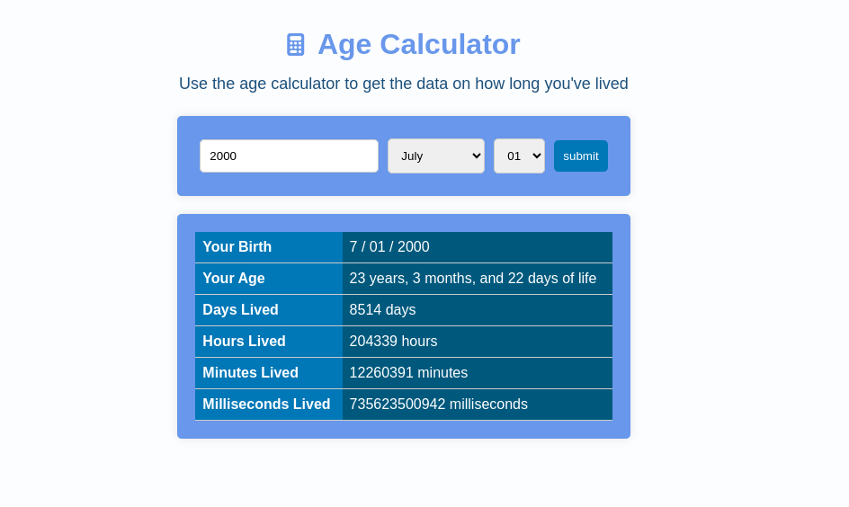

# Age Calculator App

This Age Calculator App is a simple web application that allows users to calculate their age based on their birthdate. It also provides additional information such as the number of days, hours, minutes, and milliseconds they've lived up to the current date. The app is built using HTML, CSS, and JavaScript.

## Getting Started

To use the Age Calculator App, follow these steps:

1. Clone the repository to your local machine or download the source code files.

2. Open the `index.html` file in your web browser. This will load the Age Calculator App.

## How to Use

1. Enter your birth year in the input field provided. The year should be in the format YYYY (e.g., 1990).

2. After entering the year, you can select your birth month and day from the dropdown menus.

3. Click the "Submit" button to calculate your age and additional details.

4. The app will display the following information:
   - Your birthdate
   - Your age in years, months, and days
   - The total number of days you've lived
   - The total number of hours you've lived
   - The total number of minutes you've lived
   - The total number of milliseconds you've lived

## Screenshot

    

You can access the live version of the Age Calculator App <a href="https://gabrielmassensini.github.io/age-calculator/" target="blank">HERE</a>

## Features

- Interactive and user-friendly interface.
- Automatically adjusts the number of days based on the selected month and handles leap years for February.
- Provides accurate calculations of age and time lived.

## Project Structure

The project is organized into the following key files and folders:

- `index.html`: The main HTML file for the Age Calculator App.
- `styles.css`: The CSS file for styling the app.
- `main.js`: The JavaScript file containing the app's logic.
- `README.md`: This documentation file.

## Dependencies

The app uses the Font Awesome library for icons, and the library is loaded via a CDN link.
